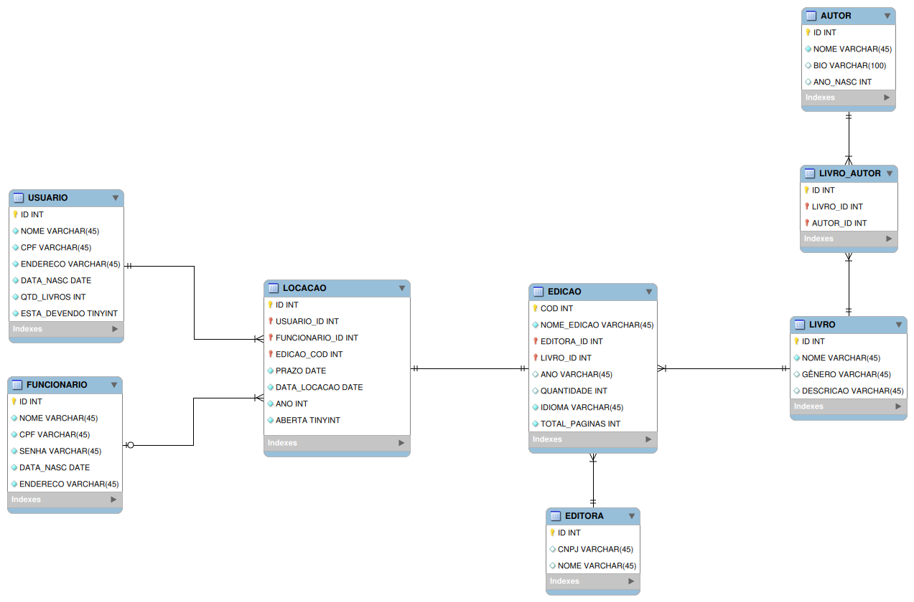

# ProjetoPOO
Um projeto para a disciplina de POO1 do curso de Sistemas de informação do IFCE Campus Crato.

<<<<<<< HEAD
 
=======

<h2>Problemática: Livraria </h2> 

Uma livraria precisa desenvolver um sistema para agilizar o
processo de empréstimo de seus livros.
Para que um usuário possa alugar um ou até cinco livros, é necessário
que ele faça um cadastro antecipado. Este cadastro deve incluir o
nome, CPF, endereço e data de nascimento. Além disso, para que o
usuário possa alugar um livro, é imprescindível que ele não tenha
nenhum livro pendente para devolução, ou seja, é necessário ter
devolvido todos os livros antes do prazo de empréstimo expirar.
Para ocorrer a operação de empréstimo, é preciso que um
funcionário a execute. Cada funcionário possui em seu cadastro, o
nome, CPF, senha, data de nascimento e um endereço. A operação é
denominada locação e envolve o funcionário, o usuário e a edição do
livro selecionado. Existe um prazo de devolução de 15 dias a partir da
data em que o livro foi alugado. A locação também registra o ano, a data
correspondentes e se está aberta.
A edição de um livro é realizada por uma editora. Cada edição deve
conter seu ISBN (código), título, ano de publicação, quantidade
disponível nas livrarias, número de páginas e o idioma disponível. Além
disso, cada livro possui um título, um gênero e uma breve descrição.
Toda editora, por sua vez, possui um nome e um CNPJ. É possível para
qualquer editora criar múltiplas edições do mesmo livro, e cada livro
pode ter várias edições por diferentes editoras.
Um autor pode escrever diversos livros individualmente e também
participar de várias colaborações literárias com outros autores. Cada
autor tem seu nome, sua biografia e sua data de nascimento. 

>>>>>>> 3cc79165da9abcdbee56c56a26408ad5cc483d6a
